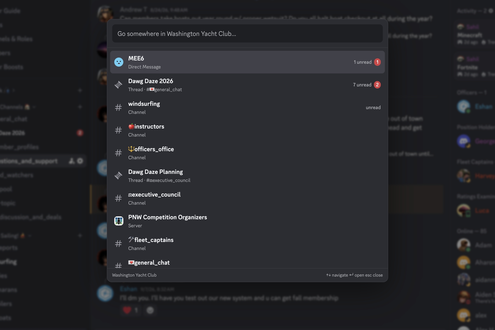

# Better Quick Switcher

A BetterDiscord plugin that replaces Discord's `Cmd+K` quick switcher.

The switcher shows channels/threads in the current server, DMs, and other servers. Unread channels/threads and DMs are at the top, so you can spam `Cmd+K` `enter` to view all unreads. Channels/threads are sorted by recent activity, and servers are ordered by their sidebar ordering.



## Get Started

This is a local plugin and is not available in the BetterDiscord marketplace.

1. [Install BetterDiscord](https://docs.betterdiscord.app/users/getting-started/installation), or run `./install-betterdiscord`.
2. From this repository, build and install the plugin:

   ```sh
   nvm use
   npm install
   npm run install-plugin
   ```

3. In Discord, open **Settings → Plugins** and enable **Better Quick Switcher**.

If BetterDiscord stops loading after a Discord update, reinstall it using your usual method or rerun `./install-betterdiscord`.

## Controls

| Key              | Action                    |
| ---------------- | ------------------------- |
| `Cmd+K`          | Open or close switcher    |
| `Ctrl+K`, `↑`    | Up                        |
| `Ctrl+J`, `↓`    | Down                      |
| `Enter`          | Open selected destination |
| `Esc`            | Close switcher            |
